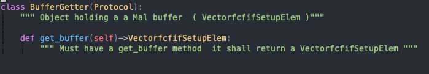
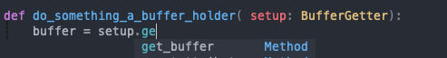
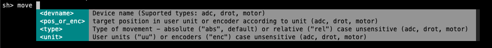
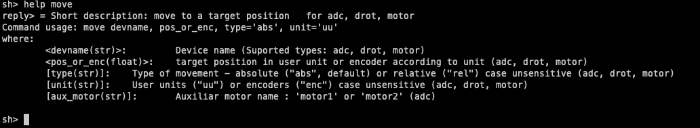

Some Programing Python Features
===============================

Typing Annotations
------------------

Annotation were introduced since python 3.0. There is no reason not to use it. It helps code clarity and increase notably code quality with code linters or tools such mypy. 

Protocol 
--------

Python offers Protocols classes. They are builtin since 3.8 but exists in the ``typing_extensions`` module in python 3.7.

Since it is often difficult to understand which methods are necessary to implement when creating a class or sub-class, PyFcs is using Ptotocol. Protocols define clearly what method and parameters are expected for each Objects. 
 
Bellow is an example of the declaration of a Protocol implicitly saying that an object must have the ``get_buffer`` method 

In pyfcs protocols are organised in one single file ``define.py`` in the core package. So any developer can have a lock of the public parameters and method a class should implement. 

Some advantage of Protocols: 

- define clearly interfaces between object without having to sub-class in chains 
- combined with typing annotation it offers editing tools (autocompletion, renaming, etc ). See screenshot below :  

- Allows to well separate developer docs (in Protocols) and user doc in Classes 

Dataclass 
---------

`dataclass` decorators are time saving development tools with absolutly no cost in runtime. It build __init__ functions  and 
object representation for you. There is no reason not to use them, dataclass comes natively with python distribution

.. code-block:: python 

   from dataclasses import dataclass 

   @dataclass 
   class Coordinate:
      x: float
      y: float 
      unit: str = "mm" 

   c = Coorinate( 10, 20) 
   assert c.x == 10
   

Interface 
=========

All PyFcs objects are using a Broker, an interface to communicate to the MalClients  and define a clear interface between Fcs object and Mal clients. 

The role of an Interface (see ``ClientInterfacer`` in define.py) is to: 

- provide access to clients 
- give access to client commands 

In the example below the interface is used to access the standard Init method inside 
a context manager (`with`). The context manager assures that any raise exceptions are logged correctly 
and therefore avoid a lot of code duplication to deal with this logging. Still this stays readable and comprehensive.   

.. code-block:: python

   from pyfcs.api import Interface

   fcs2it = Interface( 'zpb.rr://172.17.0.2:26253', timeout=60000)

   with fcs2it.command( 'Std', 'Init') as init:
      reply = init()

The above code is equivalent to something like :

.. code-block:: python 

   from pyfcs.api import Interface

   fcs2it = Interface( -'zpb.rr://172.17.0.2:26253', timeout=60000)

   init = fcs2it.get_client('Std').Init 
   try:
      reply = init()
   except MalException as exc:
      log.error( ... )
   except TimeoutException:
      log.error( ... ) 
   else:
      ...

   # etc .... 

Which is a code structure repeated many, many, times inside the ifw V4.

To execute a co-coroutine this is as simple and clear : 

.. code-block:: python 

   async with fcs2it.command( 'Std', 'Init') as ainit:
      reply = await ainit()

Interface can be built from different inputs, for instance from a consul service 

.. code-block:: python 

   from pyfcs.api import ConsulInterface 

   fcs2it = ConsulInterface('fcs2-req') 

Or from uri :

.. code-block:: python 

   from pyfcs.api import Interface 

   fcs2it = Interface('zpb.rr://172.17.0.2:26253') 

A DummyInterface is also available for test purposes. 

The good thing with these interface is that they can be defined in a package according to instrument 
configuration and used blindly in other scripts (like sequencer) without having to deal with consul or 
uri at script level. 

Device Setup 
============

One of the goal of PyFcs is to try to make plugin like architecture and try to limits the consequences of a any change. For instance changing or adding a new device parameter for instance. 

So far in ifw V4, if one have to implement a new client parameter for a device, he will have to : 

- change the json payload schema
- change the device_setup.py 
- change the setup_buffer.py file and corresponding methods  
- change the devmgr_command.py file and methods 
- change the demgr_async_command.py file and methods 

While in PyFcs architecture changes are made in one single place, inside the device setup definition. 
All other codes are generated from this file and offers more extension possibilities. 

   
A device setup is divided in two parts :

- A Mal Interface responsible to set parameters to the Mal Element and Device 
- The Setup class which makes the link between payload and parameters for the Mal Interface, it offers also 
  function to help setup which can be propagated to other classes (e.g. DevMgrCommand , ... ) 

The best way is to take an example. For the lamp :

First we create a mal interface class, there is an helper for that :

.. code-block:: python

   from ModFcfif.Fcfif import LampDevice
   from ModFcfif.Fcfif import ActionLamp 
   from ModFcfif.Fcfif import DeviceUnion

   from pyfcs.core.api import create_mal_if

   # quick create a MalIf class 
   LampMalIf = create_mal_if( 
           LampDevice, DeviceUnion.getLamp, DeviceUnion.setLamp, 
           action = ( 'getAction', 'setAction'),
           intensity = ( 'getIntensity', 'setIntensity'),
           time = ( 'getTime', 'setTime'),
           
       )
.. note::

   It is just implementing the methods defined in the Protocol defined in core/define.py

   .. code-block:: python 

      class DeviceInterfacer(Protocol):
          """ Interface between Mal Device and parameter space (a map of param->value) """
          def create_device(self):
              """ Must be abble to create Mal Device

              e.g. fcfmal.createDataEntity( LampDevice )
              """
          
          def get_device(self):
              """ Must return a curent Mal Device instance 
              e.g. elem.getDevice().getLamp()
              """

          def set_device(self, device):
              """ Must be abble to save an incoming Mal Device Instance inside its container """

          def set_id(self, id:str):
              """ must be abble to change element id """ 

          def get_id(self)->str:
              """ must be abble to return an element id """

          def set_values(self, values: dict):
              """ must be abble to receive a dictionary of values and set them to Mal Device Instance """
          
          def get_values(self)->dict:
              """ must ba abble to extract parameters values from the Mal Device Instance """

   

The ``LampMalIf`` will be used by the device Setup class to create the buffer from pre-parsed and checked values.
For instance: 

.. code-block:: python 

   lamp_if = LampMalIf( ConsulInterface('fcs2-req')) 
   lamp_if.set_id('lamp1')
   lamp_if.set_values( {'action':ActionLamp.ON, 'intensity':20.0, 'time':10} )
   lamp_if.element #<- This is the buffer with stored values 

However the user interface is the ``LampSetup`` class which will safely parse a payload, eventually change 
parameters (such as enumerator) and send it to its ``MalIf`` during setup. 

So, we can first create the class with some entry parameters :

.. code-block:: python 

   from pyfcs.core.api import BaseDeviceSetup, ParamProperty, parser 

   class LampSetup(BaseDeviceSetup):
      devtype = "lamp" 
      MalIf = LampMalIf 

      action = ParamProperty( parser.EnumNameParser(ActionLamp), 
                    description = "Lamp action.",
                    required = True
                    )
      intensity = ParamProperty( parser.FloatParser(minimum = 0, maximum = 100),
                    description = "Lamp intensity.",
                    )
      time = ParamProperty( parser.IntParser(minimum = 1),
                    description = "Lamp timer.",
                    )

At this point our lamp device have nice functionalities.

You can get the json schema built from the class :

.. code-block:: python 

   LampSetup.get_schema()
   # -- outputs --
   #{'additionalProperties': False,
   # 'properties': {'action': {'description': 'Lamp action.',
   #                           'enum': ['ON', 'OFF'],
   #                           'type': 'string'},
   #                'intensity': {'description': 'Lamp intensity.',
   #                              'maximum': 100,
   #                              'minimum': 0,
   #                              'type': 'number'},
   #                'time': {'description': 'Lamp timer.',
   #                         'minimum': 1,
   #                         'type': 'integer'}},
   # 'required': ['action'],
   # 'type': 'object'} 

Also from the class you can decompose json schema for each parameters: 

.. code-block:: python 

   LampSetup.action.get_schema()
   # --outputs-- {'type': 'string', 'enum': ['ON', 'OFF'], 'description': 'Lamp action.'}
   LampSetup.action.parser.get_schema()
   # --outputs-- {'type': 'string', 'enum': ['ON', 'OFF']}
   # etc ...

We can already use ``LampSetup`` to send a payload and then setup the hardware :

.. code-block:: python 

   lamp1 = LampSetup( ConsulInterface('fcs2-req'), 'lamp1')
   lamp1.set( action="ON", intensity=20.0, time=10 )
   lamp1.get_buffer() # The VectorfcfifSetupElem containing device buffer

   # If connected :
   lamp1.setup() # will setup the hardware 

Note that a payload not compatible with parameters parser (= json schema) will fail:  

.. code-block:: python 

   lamp1.set( action="ON", intensity=20.0, time=-10 )
   # --Raises-- ParsingError: parameter 'time': value shall be >= 1, got -10

Now we can define functions to parse the payload parameter in the context of a 
specific action ( or actually any set of other parameters). For this we can use the 
payload_parser decorator : 

.. code-block:: python 
   :emphasize-lines: 18,30

   from pyfcs.core.api import BaseDeviceSetup, ParamProperty, parser, payload_parser

   class LampSetup(BaseDeviceSetup):
      devtype = "lamp" 
      MalIf = LampMalIf 

      action = ParamProperty( parser.EnumNameParser(ActionLamp), 
                    description = "Lamp action.",
                    required = True
                    )
      intensity = ParamProperty( parser.FloatParser(minimum = 0, maximum = 100),
                    description = "Lamp intensity.",
                    )
      time = ParamProperty( parser.IntParser(minimum = 1),
                    description = "Lamp timer.",
                    )
      
      @payload_parser(action="ON")
      def switch_on(self, intensity, time):
         """ switch on the device 
        
         Args:
            intensity : Lamp intensity.
            time : Lamp timer.
         """
         self.intensity = intensity
         self.time = time
         self.action = "ON" 
   
      @payload_parser(action= 'OFF')
      def switch_off(self, ):
        """ switch off the device """
        self.action = "OFF" 

In this example ``payload_parser`` decorator says that when the action is "ON" on the received payload, the ``switch_on`` method shall be called to validate and store parameters. We can see that it does avoid hard-coded switch cases, one can add a new action without having to re-write core codes.  

We can see that the json schema has already changed according to the payload_parser rules, see the 'allOf' listes below :

.. code-block:: python 
   
   LampSetup.get_schema()
   # {'type': 'object',
   #  'properties': {'time': {'type': 'integer',
   #    'minimum': 1,
   #    'description': 'Lamp timer.'},
   #   'action': {'type': 'string',
   #    'enum': ['ON', 'OFF'],
   #    'description': 'Lamp action.'},
   #   'intensity': {'type': 'number',
   #    'minimum': 0,
   #    'maximum': 100,
   #    'description': 'Lamp intensity.'}},
   #  'required': ['action'],
   #  'additionalProperties': False,
   #  'allOf': [{'if': {'properties': {'action': {'const': 'ON'}}},
   #    'then': {'required': ['intensity', 'time'],
   #     'minProperties': 3,
   #     'maxProperties': 3}}]}

And then sending an incomplete payload should fails :

.. code-block:: python

   lamp1 = LampSetup( ConsulInterface('fcs2-req'), 'lamp1')
   lamp1.set( action="ON", time=10 )
   # --Raises-- TypeError: switch_on() missing 1 required positional argument: 'intensity'

Of course the method can be called directly :

.. code-block:: python 

   lamp1.switch_on( 40.3, 10) 
   lamp1.setup( )

We can make the reverse method for a nice round trip between user payload and what is stored in the 
buffer, using the @payload_maker decorator which works the same way : 

.. code-block:: python 
   :emphasize-lines: 30,45
   

   from pyfcs.core.api import BaseDeviceSetup, ParamProperty, parser, payload_parser, payload_maker 

   class LampSetup(BaseDeviceSetup):
      devtype = "lamp" 
      MalIf = LampMalIf 

      action = ParamProperty( parser.EnumNameParser(ActionLamp), 
                    description = "Lamp action.",
                    required = True
                    )
      intensity = ParamProperty( parser.FloatParser(minimum = 0, maximum = 100),
                    description = "Lamp intensity.",
                    )
      time = ParamProperty( parser.IntParser(minimum = 1),
                    description = "Lamp timer.",
                    )
      
      @payload_parser(action="ON")
      def switch_on(self, intensity, time):
         """ switch on the device 
        
         Args:
            intensity : Lamp intensity.
            time : Lamp timer.
         """
         self.intensity = intensity
         self.time = time
         self.action = "ON" 
    
      @payload_maker(action= 'ON')
      def dump_switch_on(self):
         """ dump payload when action= 'ON' """
         return { 
               "action" : "ON",  
               
               "intensity" : self.intensity,
               "time" : self.time,
           }
     
      @payload_parser(action= 'OFF')
      def switch_off(self, ):
        """ switch off the device """
        self.action = "OFF" 
       
      @payload_maker(action= 'OFF')
      def dump_switch_off(self):
           """ dump payload when action= 'OFF' """
           return { 
               "action" : "OFF",  
           }

The payload maker methods is just a nice feature to have in order to retrieve a valid payload from a setup object  :

.. code-block:: python

   lamp1 = LampSetup( ConsulInterface('fcs2-req'), 'lamp1')
   lamp1.switch_on( 30, 10) 
   lamp1.get_payload()
   
   #--outputs-- 
   # [{'id': 'lamp1',
   #  'param': {'lamp': {'action': 'ON', 'intensity': 30.0, 'time': 10}}}]

Okay, at this point we need to do one more thing, just flag some method as "setup_method" this is 
in order to tells pyfcs that this method can be used to generate other methods in other classes (more details below). For the lamp example we can flag ``switch_on`` and ``switch_off`` methods as such. 
Here is the full code for lamp:  

.. code-block:: python 
   :emphasize-lines: 33,56
   
   from ModFcfif.Fcfif import LampDevice
   from ModFcfif.Fcfif import ActionLamp 
   from ModFcfif.Fcfif import DeviceUnion

  
   from pyfcs.core.api import (BaseDeviceSetup, ParamProperty, parser, 
                              payload_parser, payload_maker, setup_method, 
                              create_mal_if
                              ) 

   LampMalIf = create_mal_if(
           LampDevice, DeviceUnion.getLamp, DeviceUnion.setLamp,
           action = ( 'getAction', 'setAction'),
           intensity = ( 'getIntensity', 'setIntensity'),
           time = ( 'getTime', 'setTime'),
       )

   class LampSetup(BaseDeviceSetup):
      devtype = "lamp" 
      MalIf = LampMalIf 

      action = ParamProperty( parser.EnumNameParser(ActionLamp), 
                    description = "Lamp action.",
                    required = True
                    )
      intensity = ParamProperty( parser.FloatParser(minimum = 0, maximum = 100),
                    description = "Lamp intensity.",
                    )
      time = ParamProperty( parser.IntParser(minimum = 1),
                    description = "Lamp timer.",
                    )
      
      @setup_method
      @payload_parser(action="ON")
      def switch_on(self, intensity, time):
         """ switch on the device 
        
         Args:
            intensity : Lamp intensity.
            time : Lamp timer.
         """
         self.intensity = intensity
         self.time = time
         self.action = "ON" 
      
      @payload_maker(action= 'ON')
      def dump_switch_on(self):
         """ dump payload when action= 'ON' """
         return { 
               "action" : "ON",  
               
               "intensity" : self.intensity,
               "time" : self.time,
           }
      
      @setup_method
      @payload_parser(action= 'OFF')
      def switch_off(self, ):
        """ switch off the device """
        self.action = "OFF" 
       
      @payload_maker(action= 'OFF')
      def dump_switch_off(self):
           """ dump payload when action= 'OFF' """
           return { 
               "action" : "OFF",  
           }

From this we can create two classes The ``LampCommand`` class and the ``LampAsyncCommand`` class. 
There is no need to re-define all methods, all the ones decorated with setup_method will be created 
inside the class. We just need to provide a Setup class.  

.. code-block:: python 
   
   from pyfcs.core.api import BaseDeviceCommand 
   from pyfcs.api import ConsulInterface 

   class LampCommand(BaseDeviceCommand):
      Setup = LampSetup 

An example of use case with the command method, reset , init, enable and 
than switch_on for 2 seconds. 

.. code-block:: python 

   lamp1 = LampCommand( ConsulInterface('fcs2-req'), 'lamp1')
   
   lamp1.reset()
   lamp1.wait( 'lcs.substate', 'NotReady')
   lamp1.init()
   lamp1.wait( 'lcs.substate', lambda s: s.startswith('Ready'))
   lamp1.enable()
   lamp1.wait( 'lcs.state', 'Operational')

   lamp1.switch_on( 50, 2)
   lamp1.wait( 'lcs.substate', 'Off')

Same business with Asynchronous Methods 

.. code-block:: python 
   
   from pyfcs.core.api import BaseDeviceAsyncCommand 
   from pyfcs.api import ConsulInterface 
   from asyncio import run 

   class LampAsyncCommand(BaseDeviceAsyncCommand):
      Setup = LampSetup 
   
   lamp1 = LampAsyncCommand( ConsulInterface('fcs2-req'), 'lamp1')
   
   async def test_lamp(lamp):
      await lamp.reset()
      await lamp.wait( 'lcs.substate', 'NotReady')
      
      await lamp.init()
      await lamp.wait( 'lcs.substate', lambda s: s.startswith('Ready'))
      
      await lamp.enable()
      await lamp.wait( 'lcs.state', 'Operational')

      await lamp.switch_on( 50, 2)
      await lamp.wait( 'lcs.substate', 'Off')

   run( test_lamp(lamp1))

Register
--------

In order to retrieve a Setup, a Command or an AsyncCommand device class from the device type string 
we need to register it with the function  `register_device`. If only the Setup class is given it will 
create the Command and AsyncCommand classes 

.. code-block:: python 

   from pyfcs.core.api import register_device 

   register_device( LampSetup) 

The classes can be retrieved like this : 

.. code-block:: python 
   
   from pyfcs.core.api import setup_class, command_class, async_command_class

   LampSetup = setup_class('lamp') 
   LampCommand = command_class('lamp') 
   LampAsyncCommand = async_command_class('lamp') 

Setup Buffer 
=============

The DevMgrSetup class is a setup buffer for one fcs (one server). 

There is almost nothing to do to create a DevMgrSetup class. All setup functions 
are created automatically as well from the DeviceSetup classes. 

.. code-block:: python 
   
   from pyfcs import devices # this register all standard devices 
   from pyfcs.core.api import BaseDevMgrSetup
   
   class Fcs2DevMgrSetup( BaseDevMgrSetup ):
      pass 

The created class will have all the SetupDevice methods propagated. 

.. code-block:: python 

   from pyfcs.api import ConsulInterface 

   fcs2_setup = Fcs2DevMgrSetup( ConsulInterface( 'fcs2-req') )
   # assuming server has two lamps and one motor 

   fcs2_setup.add_lamp_switch_on( 'lamp1', 92, 10)
   fcs2_setup.add_lamp_switch_on( 'lamp2', 30, 5)
   fcs2_setup.add_motor_move('sdm', 30, unit="uu", type="abs")
   
   fcs2_setup.setup()

We can also do the same this way (strictly equivalent):

.. code-block:: python 

   fcs2_setup.get('lamp1').switch_on(92, 10)
   fcs2_setup.get('lamp2').switch_on(30, 5)
   fcs2_setup.get('sdm').move(30, unit="uu", type="abs")
   
   fcs2_setup.setup()

We can also retrieve retrieve and set a payload

.. code-block:: python 

   fcs2_setup.get('lamp1').switch_on(92, 10)
   fcs2_setup.get('lamp2').switch_on(30, 5)
   fcs2_setup.get('sdm').move(30, unit="uu", type="abs")
   
   fcs2_setup.get_payload()
   # -- outputs --
   #  [{'id': 'lamp1',
   #  'param': {'lamp': {'action': 'ON', 'intensity': 92.0, 'time': 10}}},
   #  {'id': 'lamp2',
   #  'param': {'lamp': {'action': 'ON', 'intensity': 30.0, 'time': 5}}},
   #  {'id': 'sdm',
   #  'param': {'motor': {'action': 'MOVE_ABS', 'unit': 'UU', 'pos': 30.0}}}]

.. code-block:: python

   fcs2_setup.set_payload( 
      [{'id': 'lamp1',
        'param': {'lamp': {'action': 'ON', 'intensity': 92.0, 'time': 10}}},
       {'id': 'lamp2',
        'param': {'lamp': {'action': 'ON', 'intensity': 30.0, 'time': 5}}},
       {'id': 'sdm',
        'param': {'motor': {'action': 'MOVE_ABS', 'unit': 'UU', 'pos': 30.0}}}]
   )
   
   
   fcs2_setup.get('lamp1').get_payload()
   # -- outpus --
   #  [{'id': 'lamp1',
   # 'param': {'lamp': {'action': 'ON', 'intensity': 92.0, 'time': 10}}}]v
   

   fcs2_setup.setup(keep=True) # setup and keep payload/buffer 

DevMgr command 
==============

Similary to device command, there is a Device manager command class to send command to a device manager 
server. The Commad Class  needs a Setup class. Other related devices methods (the ``setup_method``) 
are built automaticaly.

.. code-block:: python 
   
   from pyfcs import devices # register all standard device 
   from pyfcs.core.api import BaseDevMgrCommands 

   class Fcs2Commands( BaseDevMgrCommands ):
      ... 

Note,  so far this is just similar to the generic DevMgrCommands : ``from pyfcs.api import DevMgrCommands``

And then one can use it: 

.. code-block:: python 

   from pyfcs.api import ConsulInterface 
   
   fcs2 = Fcs2Commands( ConsulInterface('fcs2-req'))
   
   fcs2.reset() 
   fcs2.init()
   fcs2.enable()
   
   fcs2.switch_on( 'lamp1'. 30.5, 10) 
   # similar to 
   fcs2.get('lamp1').switch_on( 30.5, 10)

.. code-block:: python 

   # create a new setup for fcs 
   park_setup = fcs2.new_setup()
   park_setup.get('lamp1').switch_off( )
   park_setup.get('lamp2').switch_off( )
   park_setup.get('sdm').move( 0.0) 
   
One can define a ``DeviceProperty`` which gives access to the device at attribute level inside the class. Also 
we can limits the devicet type disponible inside the class (therefore limits the built methods): 

.. code-block:: python 

   from pyfcs import devices # register all standard device 
   from pyfcs.core.api import BaseDevMgrCommands 

   class Fcs2Commands( BaseDevMgrCommands, devtypes=('lamp', 'motor') ):
      lamp1 = DeviceProperty('lamp')
      lamp2 = DeviceProperty('lamp')
      sdm = DeviceProperty('motor')

   fcs2 = Fcs2Commands( ConsulInterface('fcs2-req'))

   fcs2.lamp1.switch_on( 30.5, 10)
   
.. code-block:: python 
   
    park_setup = fcs2.new_setup()
    park_setup.lamp1.switch_off( )
    park_setup.lamp2.switch_off( )
    park_setup.sdm.move( 0.0) 

One can use the device property to custom the client capabilities. For instance, bellow we can subclass the lamp
device and add the capability to switch lamp by three intensity name from the client. 

.. code-block:: python 

   from enum import Enum 
   from pyfcs.devices.lamp import LampSetup 
   from pyfcs.core.api import  setup_method, register_device 

   class LampIntensities(float, Enum):
      LOW = 10.0
      MEDIUM = 43.6
      HIGH = 89.6 

   class MyLamp(LampSetup):
      devtype= "mylamp" 
            
      @setup_method
      def switch_low(self, time:int ):
         self.switch_on( LampIntensities.LOW, time)  
      
      @setup_method
      def switch_medium(self, time:int ):
         self.switch_on( LampIntensities.MEDIUM, time)
      
      @setup_method
      def switch_high(self, time: int):
         self.switch_on( LampIntensities.HIGH, time)
      
   
   register_device( MyLamp )

And then we can use it in Fcs2Commands 

   
.. code-block:: python 

   from pyfcs import devices # register all standard device 
   from pyfcs.core.api import BaseDevMgrCommands 

   class Fcs2Commands( BaseDevMgrCommands, devtypes=('mylamp', 'motor') ):
      lamp1 = DeviceProperty('mylamp')
      lamp2 = DeviceProperty('mylamp')
      sdm = DeviceProperty('motor')

   fcs2 = Fcs2Commands( ConsulInterface('fcs2-req'))

   fcs2.lamp1.switch_medium( 10)
   
Also from the setup :

.. code-block:: python 

   fcs2_setup = fcs2.new_setup()

   fcs2_setup.add_mylamp_switch_medium('lamp1',  10) 
   # equivalent to 
   fcs2_setup.lamp1.switch_medium( 10 ) 
   
   fcs2_setup.setup()

.. note:: 

   PyFcs handles conflict between method with equal name but for different device types. 
   As long as the order of the method arguments are respected everything will work fine (including shell client, see bellow).
   If argument are different it will still work but the shell client online help will be uncomplete.  
   
   For instance both lamp and actuator have a ``switch_on`` method. They are declared : 

   .. code-block:: python 
      
      # for lamp 
       def switch_on(self, intensity, time):
           """ switch_on
           
           Args:
               intensity (float) : Lamp intensity.
               time (int) : Lamp timer.
           """
      
      # for actuator 
      @setup_method
      def switch_on(self, ):
         """ switch_on 
         """
   The automaticaly generated method would look like this: 

   .. code-block:: python 

      def switch_on(self, devname: str, intensity=Empty, time=Empty)->None:
          """switch_on for lamp, actuator

            Args:
              devname (str): Device name (Suported types: lamp, actuator)
              intensity : Lamp intensity. (lamp)
              time : Lamp timer. (lamp)
          """
          devtype = self.get_devtype(devname)
          devtype = devtype.lower()
          DeviceSetup = self.__register__.setup_class(devtype)
          device_setup = DeviceSetup( self.interface, devname )

          if devtype in ('lamp',):
              check_empty(devtype,  intensity= intensity, time= time )
              device_setup.switch_on( intensity, time )

          elif devtype in ('actuator',):
              device_setup.switch_on(  )

          else:
              raise ValueError(f"Function available only for {', '.join(('lamp', 'actuator'))}. got a {devtype!r}")

          return device_setup.setup()      

Assembly 
========

PyFcs offers a way to create assemblies at client level. Assembly allows manipulation of several 
hardware from one client interface. In term of software they are a mix between a DevMgrSetup/DevMgrCommands and a DeviceSetup/DeviceCommand. 
Let us define an assembly made of two filter wheels. The setup input is the filter name. 
We can define parameters and method exectly as we do for a device.
The assembly then needs an 'apply' method which setup individual motors from the Assembly buffer into a freshly 
new made DevMgrSetup class. 

.. code-block:: python 

   from pyfcs.core.api import (BaseAssemblySetup, ParamProperty,
                               setup_method, payload_parser, payload_maker,
                               parser, DeviceProperty, register_device )
   
   filter_setup = { # wheels 1 & 2 positions 
      "FREE": (0.0, 0.0), 
      "J" : ( 60.0, 0.0),
      "H" : ( 120.0, 0.0),
      "K" : ( 180.0, 0.0), 
      "OII": ( 0.0, 60.0), 
      "OII_Z2": ( 0.0 , 120.0)
   }

   class FilterSetup( BaseAssemblySetup ):
      devtype = "filter"  
      wheel1 = DeviceProperty('motor', 'ndf')
      wheel2 = DeviceProperty('motor', 'ncp') 
   
      action = ParamProperty( parser.StringParser( enum=["SET", "OFF" ]) , 
                              description = "Filter assembly action", 
                              required=True
                              )
      filter = ParamProperty( parser.StringParser( enum=list(filter_setup) ), 
                              description = "Filter name "
                           )

      @setup_method
      @payload_parser(action="SET")
      def set_filter(self, filter: str)->None:
         """ Set the filter 
         
         Args: 
            filter (str): filter name 
         """
         self.action = "SET"
         self.filter = filter 

      @payload_maker(action="SET")
      def dump_set_filter(self):
         return {"action": "SET", "filter": self.filter} 

      @setup_method
      @payload_parser(action="OFF")
      def set_off(self)->None:
         self.action = "OFF"

      @payload_maker(action="OFF")
      def dump_set_off(self):
         return {"action": "SET"} 

      def apply(self, setup):
         if self.action == "SET":
            pos1, pos2 = filter_setup[self.filter] 
            self.wheel1.move( pos1 ) 
            self.wheel2.move( pos2 ) 
         elif self.action == "OFF":
            self.wheel1.move( 0.0 ) 
            self.wheel2.move( 0.0 ) 

         setup.add( self.wheel1, self.wheel2 )
   
   
   r = register_device( FilterSetup ) # register the assembly and create command classes 
   FilterCommand = r.Command 
   FilterAsyncCommand = r.AsyncCommand 

Usage : 

.. code-block:: python 

   filter_setup = FilterSetup( ConsulInterface('fcs1-req')) 
   filter_setup.set_filter( 'H') 
   filter_setup.setup() #  setup the hardware 

.. code-block:: python 
   
   filter = FilterCommand( ConsulInterface('fcs1-req'))
   filter.reset() # reset both assembly motors 
   filter.init()  # init both motor  
   filter.enable() # enable both motor 
   filter.set_filter("K") # setup the hardware 
    

An Assembly can be then included inside a DevMgr Class 

.. code-block:: python 
   
   from pyfcs.core.api import BaseDevMgrCommands 

   class Fcs1Command( BaseDevMgrCommands):
      filter1 = DeviceProperty('filter')

   fcs1 = Fcs1Command( ConsulInterface('fcs1-req', 60000) )
   
   setup = fcs1.new_setup()
   #e.g.
   setup.set_payload( [{'id': 'filter1', 'param': {'filter': {'action': 'SET', 'filter': 'H'}}}] )
   # equivalent to 
   setup.add_filter_set_filter( 'filter1', 'H' ) 
   # or 
   setup.get('filter1').set_filter( 'H')
   # One can have a loock on what the assembly does to a buffer 
   setup2 = fcs1.new_setup()

   setup.filter1.apply( setup2 )
   setup2.get_payload()
   # -- outputs ---
   # [{'id': 'motor1',
   #  'param': {'motor': {'action': 'MOVE_ABS', 'unit': 'UU', 'pos': 120.0}}},
   #  {'id': 'motor2',
   #  'param': {'motor': {'action': 'MOVE_ABS', 'unit': 'UU', 'pos': 0.0}}}]

Filter Assembly command method are part of the Fcs1Command :

.. code-block:: python 

   fcs1.set_filter('filter1', 'OII')

Command class creation 
======================

They are function to create command classes directly from either device manager config file, 
a client interface connection or a dictionary of devname->devtype. 
The created class will have only the methods of devices inside the device manager and will 
have the device names as device properties. 

Example from a device manager config file 

.. code-block:: python 

   from pyfcs.api import create_command_class
   
   Fcs1 = create_command_class( 'Fcs1', 'nomad/fcs1.yaml.tpl' )
   fcs1 = Fcs1.from_consul('fcs1-req')
   fcs1.move( 'motor1', 30.0)
   # eq to 
   fcs1.motor1.move( 30.0 ) 

This is probably all one needs to drive devices or send setups. Note that special devices  
need to be registered before calling the create_command_class. 
Undernees the create_command_class also create the DevMgrSetup class, so it is also ni sync with 
what is configured on server. 

.. code-block:: python 
   
   fcs1_setup = fcs1.new_setup()
   fcs1_setup.motor1.move(23)
   fcs1_setup.motor2.move( 12)
   fcs1_setup.setup() # setup the hardware  

Example from a client interface ( connection to server needed to build the devname->devtype map) 

.. code-block:: python 

   from pyfcs.api import create_command_class, ConsulInterface 

   fcs1_if = ConsulInterface('fcs1-req') 

   Fcs1 = create_command_class( 'Fcs1',  fcs1_if)
   fcs1 = Fcs1( fcs1_if )
   fcs1.motor1.move( 2.0, type="rel" ) 

Same thing to create a AsyncCommand class 

.. code-block:: python 

   from pyfcs.api import create_async_command_class, ConsulInterface 

   fcs1_if = ConsulInterface('fcs1-req') 

   Fcs1Async = create_async_command_class( 'Fcs1',  fcs1_if)
   fcs1 = Fcs1Async( fcs1_if )
   await fcs1.motor1.move( 2.0, type="rel" ) 

Cli 
====

PyFcs Commands object are compatible with the shell client 

.. code-block:: shell 

   > acli --module pyfcs.devmgr_async_commands\
          --class_name DevMgrAsyncCommands\ 
          --class_args "zpb.rr://172.17.0.2:27817, 60000

Note, hey are more function then any would want in the client. I cannot do anything (unless adding '_' to all unwanted method, which 
i will not do). My proposition is simple in the acli `class_meta_data` just add in the method loop building  :

.. code-block:: python 
   
   if getattr( available_methods, '__not_for_cli__', False): continue 

Then one can declare methods as not good for cli with a decorator 

.. code-block:: python 

   def not_for_cli(func):
      func.__not_for_cli__ = True 
      return func 

   class C:
      
      @not_for_cli
      def get(self, ...):
         ... 

